<div align="center">

# AWS Networking Project with Terraform

**A modular, self-healing, low-cost AWS web tier: custom VPC, bastion host, Application Load Balancer, Auto Scaling in private subnets, CloudWatch monitoring and SNS alerts.**


-232F3E?logo=amazonaws&logoColor=white>)


[Architecture](#architecture) · [Quick start](#quick-start) · [Verify](#verify-it-works) · [Self-healing demo](#self-healing-demo) · [Monitoring](#monitoring-and-alerts) · [Troubleshooting](#troubleshooting-log)

</div>

<p align="center">
  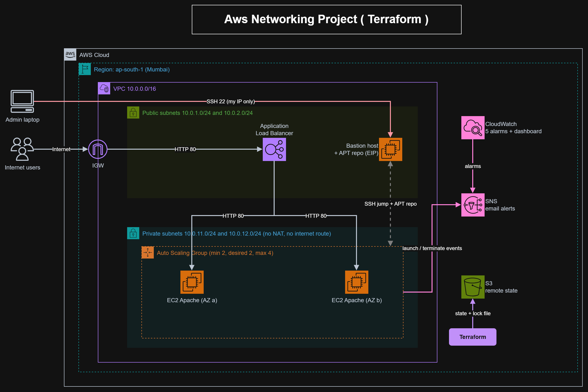
</p>

---

## Overview

Everything in this project is built with Terraform: a custom VPC, a bastion host, an Application Load Balancer in front of an Auto Scaling group in **private** subnets, CloudWatch monitoring with email alerts, and remote state in S3.

It is designed to stay cheap. There is **no NAT Gateway**: the private servers install their software from an internal package repository hosted on the bastion.

### Highlights

|                           |                                                                                                                   |
| ------------------------- | ----------------------------------------------------------------------------------------------------------------- |
| 🔒 **Private by default** | App servers have no public IP and no route to the internet                                                        |
| 🩺 **Self-healing**       | ALB health checks drive the Auto Scaling group, so unhealthy instances are replaced automatically                 |
| 📬 **Observable**         | 5 CloudWatch alarms, a 6-widget dashboard and SNS email alerts for alarms and for every launch or terminate event |
| 💸 **Low cost**           | No NAT Gateway: an internal APT repository on the bastion replaces it                                             |
| 🧱 **Modular**            | 8 reusable modules, wired together in a single `environment/dev` root module                                      |
| 🗄️ **Safe state**         | S3 remote state with versioning, encryption and native lock file (no DynamoDB)                                    |

### Preview

<table>
  <tr>
    <td align="center">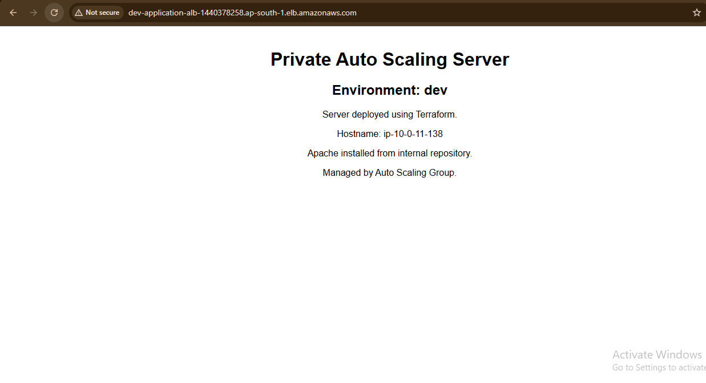<br><sub>Load balancing</sub></td>
    <td align="center">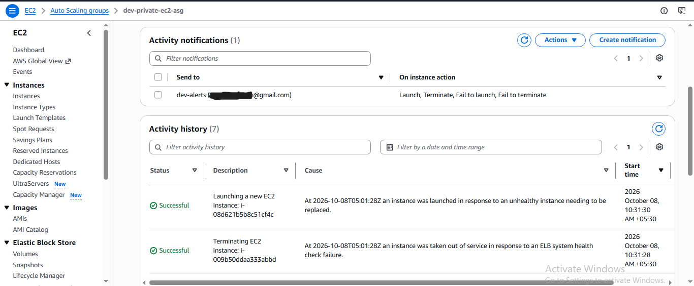<br><sub>Self-healing</sub></td>
    <td align="center">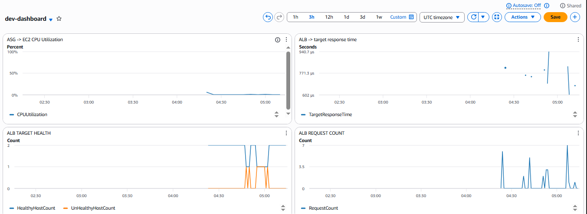<br><sub>Monitoring</sub></td>
  </tr>
</table>

---

## Table of contents

- [Architecture](#architecture)
- [What it deploys](#what-it-deploys)
- [Key design decisions](#key-design-decisions)
- [Repository structure](#repository-structure)
- [Quick start](#quick-start)
- [Verify it works](#verify-it-works)
- [Self-healing demo](#self-healing-demo)
- [Monitoring and alerts](#monitoring-and-alerts)
- [Troubleshooting log](#troubleshooting-log)
- [Cost](#cost)
- [Limitations and next steps](#limitations-and-next-steps)
- [Clean up](#clean-up)
- [Author and acknowledgements](#author-and-acknowledgements)

---

## Architecture

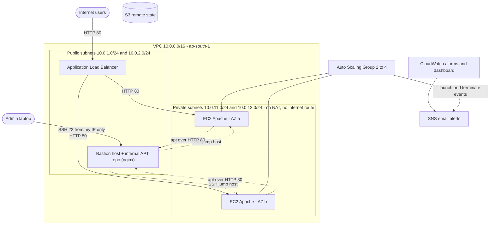

**Traffic paths**

| Path             | Flow                                                               |
| ---------------- | ------------------------------------------------------------------ |
| Web traffic      | Internet → ALB (public subnets) → Apache on EC2 (private subnets)  |
| Admin access     | Admin laptop (your IP only) → bastion → private instances over SSH |
| Package installs | Private instances → bastion's internal APT repo over HTTP 80       |
| Alerts           | CloudWatch alarms and ASG events → SNS → email                     |

---

## What it deploys

| Module                | What it creates                                                                                                                             |
| --------------------- | ------------------------------------------------------------------------------------------------------------------------------------------- |
| `backend/`            | S3 bucket for Terraform state (versioning, AES256 encryption, all public access blocked). Applied once, separately.                         |
| `modules/vpc`         | VPC, 2 public + 2 private subnets across 2 AZs, internet gateway, public route table.                                                       |
| `modules/security`    | Security groups for bastion, ALB and private servers, plus custom network ACLs for the public and private tiers.                            |
| `modules/iam`         | EC2 role and instance profile (baseline, no policies attached yet).                                                                         |
| `modules/bastion`     | Ubuntu 22.04 `t3.micro` with an Elastic IP. Acts as SSH jump host and as the internal APT repository.                                       |
| `modules/alb`         | Internet-facing Application Load Balancer, target group with health checks, HTTP listener.                                                  |
| `modules/autoScaling` | Launch template, Auto Scaling group (min 2, desired 2, max 4), CPU target-tracking policy (35%), and launch/terminate notifications to SNS. |
| `modules/cloudWatch`  | 5 alarms and a 6-widget dashboard.                                                                                                          |
| `modules/sns`         | Alerts topic with an email subscription.                                                                                                    |

---

## Key design decisions

**1. No NAT Gateway, internal package repository.**
Private instances have no route to the internet. On boot, the bastion downloads Apache and its dependencies, builds an APT repository with `dpkg-scanpackages`, and serves it over nginx. The private instances disable the public Ubuntu mirrors and install Apache from the bastion. This avoids the NAT Gateway's hourly and data charges.

**2. Layered network security.**
Private servers have no public IP. Security groups reference each other instead of IP ranges: the private SG accepts HTTP only from the ALB's SG and SSH only from the bastion's SG. Custom NACLs add a second, stateless layer. SSH to the bastion is restricted to the deployer's public IP, detected automatically at apply time.

**3. Self-healing through the load balancer.**
The Auto Scaling group uses `health_check_type = "ELB"`. If the ALB marks a target unhealthy, the ASG terminates that instance and launches a replacement automatically. Launch and terminate events are published to the same SNS topic as the alarms, so every replacement sends an email.

**4. Remote state with native locking.**
State lives in S3 with versioning and encryption. Locking uses Terraform's native S3 lock file (`use_lockfile = true`), so no DynamoDB table is needed.

**5. Modular layout.**
Each concern is its own module. `environment/dev` wires them together and is the only place with environment-specific values.

---

## Repository structure

```
.
├── backend/                 # one-time bootstrap: S3 bucket for remote state
├── environment/
│   └── dev/                 # root module: wires everything together
│       ├── main.tf
│       ├── backend.tf       # S3 backend config
│       ├── variables.tf
│       ├── outputs.tf
│       ├── provider.tf
│       └── versions.tf
├── modules/
│   ├── vpc/
│   ├── security/
│   ├── iam/
│   ├── bastion/
│   ├── alb/
│   ├── autoScaling/         # includes user_data.sh.tpl
│   ├── cloudWatch/
│   └── sns/
└── docs/images/             # screenshots used in this README
```

---

## Quick start

### Prerequisites

| Requirement         | Notes                                                           |
| ------------------- | --------------------------------------------------------------- |
| Terraform `>= 1.11` | Needed for native S3 state locking                              |
| AWS CLI             | Configured with credentials that can create the resources above |
| EC2 key pair        | Must already exist in `ap-south-1`                              |
| Email address       | Where alarm and ASG notifications are sent                      |

### 1. Clone the repository

```bash
git clone https://github.com/qwertyuno0/aws-networking-project.git
cd aws-networking-project
```

### 2. Bootstrap remote state (once)

S3 bucket names are globally unique. Change `devops-project-aws-tf-01` to your own name in both `backend/main.tf` and `environment/dev/backend.tf` first.

```bash
cd backend
terraform init
terraform apply
```

### 3. Deploy the environment

Copy the example variables file and fill in your own values (`terraform.tfvars` is gitignored):

```bash
cd environment/dev
cp terraform.tfvars.example terraform.tfvars
# edit terraform.tfvars: set key_name and alert_email
```

```bash
terraform init
terraform plan -out=tfplan
terraform apply tfplan
```

### 4. Confirm the SNS subscription

AWS sends a confirmation email. Click the link, otherwise no alerts will arrive.

<p align="center">
  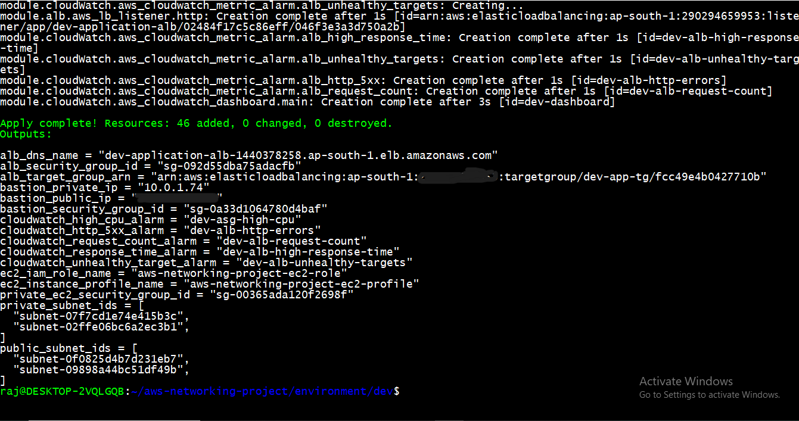<br>
  <sub><i><code>terraform apply</code> completing and printing the outputs.</i></sub>
</p>

---

## Verify it works

### Load balancing across two private servers

Open the ALB DNS name (`terraform output alb_dns_name`) in a browser and refresh. The hostname on the page alternates between the two servers.

<table>
  <tr>
    <th align="center">Server 1</th>
    <th align="center">Server 2</th>
  </tr>
  <tr>
    <td></td>
    <td>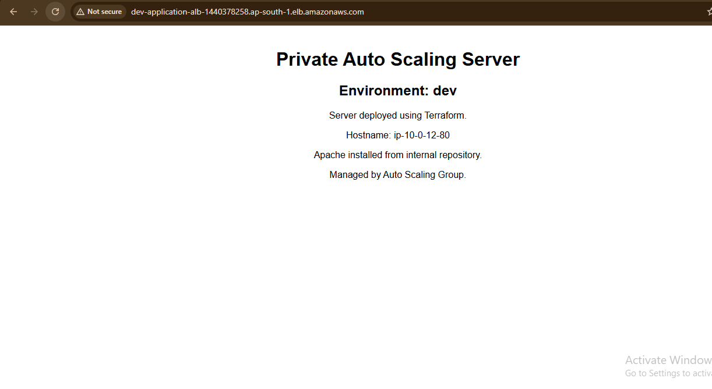</td>
  </tr>
</table>

<sub><i>Same URL, two different private instances serving the request.</i></sub>

### Both targets healthy

<p align="center">
  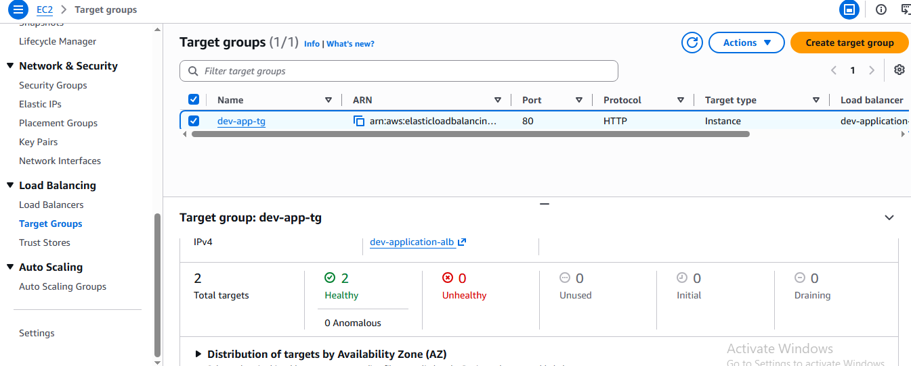<br>
  <sub><i>Target group <code>dev-app-tg</code> with both instances healthy.</i></sub>
</p>

### Private servers have no public IP

<p align="center">
  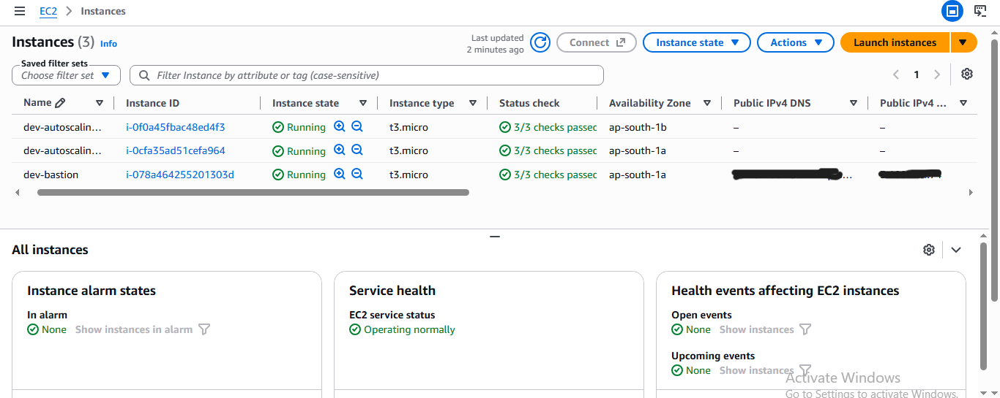<br>
  <sub><i>The bastion is the only instance with a public address. The app servers sit in private subnets in different AZs.</i></sub>
</p>

### SSH to a private server through the bastion

```bash
ssh -i your-key.pem -J ubuntu@<bastion_public_ip> ubuntu@<private_instance_ip>
```

<p align="center">
  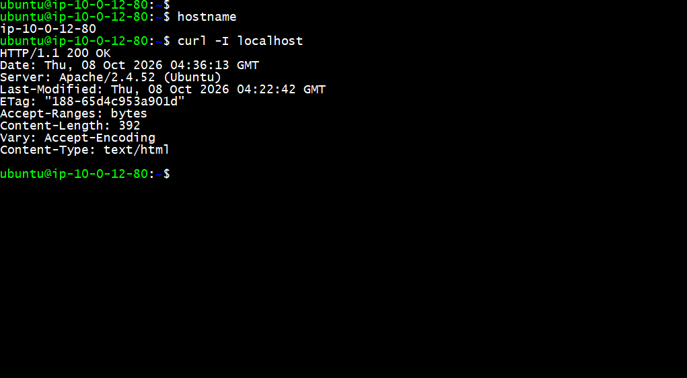<br>
  <sub><i>Reaching a private instance only via the bastion.</i></sub>
</p>

### Remote state

<p align="center">
  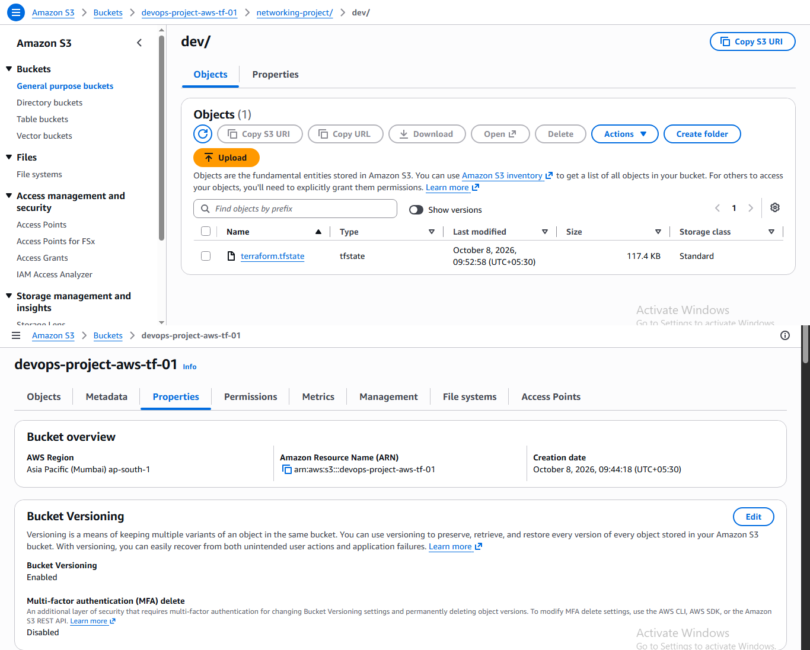<br>
  <sub><i>State stored remotely in a versioned, encrypted bucket.</i></sub>
</p>

---

## Self-healing demo

**Goal:** prove that an unhealthy instance is removed and replaced automatically, with no manual action.

### 1. Break one server

Connect through the bastion and stop Apache:

```bash
sudo systemctl stop apache2
```

Alternatively, mark it unhealthy from the CLI:

```bash
aws autoscaling set-instance-health \
  --instance-id <id> \
  --health-status Unhealthy \
  --region ap-south-1
```

### 2. What happens next, with no further input

| Step                                                                    | Roughly when          |
| ----------------------------------------------------------------------- | --------------------- |
| ALB health check fails twice, target marked `unhealthy`                 | within about a minute |
| `dev-alb-unhealthy-targets` alarm emails you                            | a few minutes         |
| ASG terminates the unhealthy instance and launches a replacement        | within a few minutes  |
| Old instance drains for 90 seconds, then is terminated                  | about 90 seconds      |
| Replacement boots, installs Apache from the bastion repo, turns healthy | a few more minutes    |

The site stays up throughout because the other instance keeps serving traffic.

<p align="center">
  <br>
  <sub><i>The ASG terminating the unhealthy instance and launching a replacement.</i></sub>
</p>

<p align="center">
  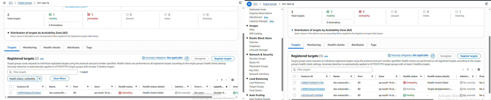<br>
  <sub><i>The target group mid-replacement: one target draining, a new one registering.</i></sub>
</p>

<p align="center">
  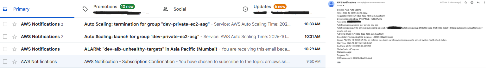<br>
  <sub><i>Every launch and terminate event is emailed through SNS.</i></sub>
</p>


---

## Monitoring and alerts

All alarms notify the SNS topic, which emails the address you provide.

| Alarm                        | Metric                             | Condition                        |
| ---------------------------- | ---------------------------------- | -------------------------------- |
| `dev-asg-high-cpu`           | EC2 `CPUUtilization` (ASG average) | above 30% for 1 period of 5 min  |
| `dev-alb-unhealthy-targets`  | ALB `UnHealthyHostCount`           | above 0 for 2 periods of 1 min   |
| `dev-alb-request-count`      | ALB `RequestCount` (sum)           | above 50 for 2 periods of 1 min  |
| `dev-alb-high-response-time` | ALB `TargetResponseTime` (avg)     | above 5 s for 3 periods of 1 min |
| `dev-alb-http-errors`        | ALB `HTTPCode_ELB_5XX_Count` (sum) | above 5 for 1 period of 1 min    |

> **Note:** EC2 publishes CPU data every 5 minutes with basic monitoring, so that alarm uses a 300-second period. The CPU threshold is deliberately low so it is easy to trigger in a demo. Use 70 to 80% for real workloads.

<p align="center">
  <br>
  <sub><i>Dashboard: ASG CPU, group capacity, request count, response time, target health, 5xx errors.</i></sub>
</p>

<p align="center">
  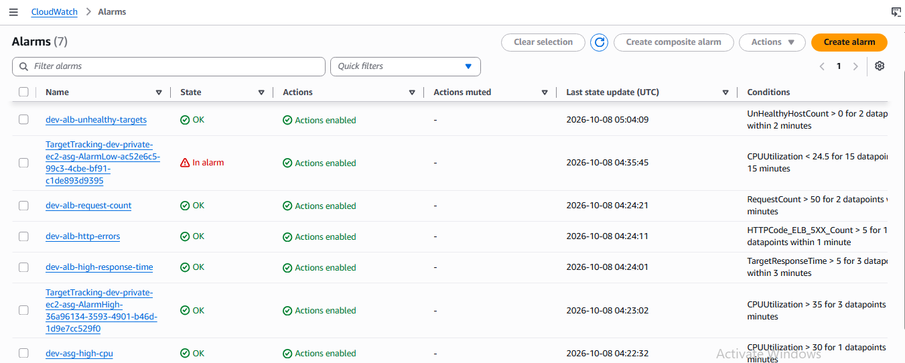<br>
  <sub><i>The five alarms managed by Terraform.</i></sub>
</p>

<p align="center">
  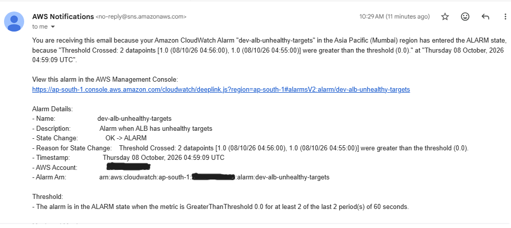<br>
  <sub><i>An alarm notification delivered by SNS.</i></sub>
</p>

---

## Troubleshooting log

Problems hit while building this, and how they were fixed.

<details>
<summary><b>Click to expand the full table (8 issues)</b></summary>
<br>

| Symptom                                                                               | Cause                                                                                                         | Fix                                                                        |
| ------------------------------------------------------------------------------------- | ------------------------------------------------------------------------------------------------------------- | -------------------------------------------------------------------------- |
| Only some alarms sent emails                                                          | Two alarms had no `alarm_actions`                                                                             | Added `alarm_actions` and `ok_actions` pointing to the SNS topic           |
| Unhealthy instances were never replaced                                               | ASG used the default EC2 health check, which ignores the ALB                                                  | Set `health_check_type = "ELB"`                                            |
| CPU alarm with a 60 s period rarely had data                                          | Basic monitoring publishes EC2 CPU every 5 minutes                                                            | Changed the period to 300 s                                                |
| `user_data` script behaved oddly                                                      | Indented heredoc terminator in an inline Terraform string                                                     | Moved the script to `user_data.sh.tpl` and load it with `templatefile()`   |
| VPC used `172.32.0.0/16`                                                              | That range is outside the private RFC1918 space                                                               | Switched to `10.0.0.0/16`, defined once in a `local`                       |
| `use_lockfile` needed a newer Terraform than declared; DynamoDB lock table was unused | Native S3 locking requires Terraform 1.10+                                                                    | Required `>= 1.11` and removed the DynamoDB table                          |
| On fresh deploys, one of two instances sometimes stayed unhealthy                     | Intermittent `apt` failure at first boot (likely lock contention with first-boot apt services or repo timing) | Wrapped `apt-get update` and `install` in a retry loop with a lock timeout |
| Replaced instance kept running about 5 minutes                                        | Default target group deregistration delay is 300 s                                                            | Set `deregistration_delay = 90`                                            |

</details>

---

## Cost

**Billable while running:**

- Application Load Balancer
- Three `t3.micro` instances (bastion plus two app servers, up to five at maximum scale)
- Public IPv4 addresses (load balancer nodes and the bastion's Elastic IP)

Free-tier coverage depends on when the AWS account was created, so check the Billing console and the AWS Pricing Calculator.

> **Tip:** Run `terraform destroy` when you finish a session. The `backend/` bucket costs almost nothing and can stay.

---

## Limitations and next steps

### Known limitations

- **The bastion is a dependency at boot.** New instances need its package repository to install Apache. Existing instances keep working if it goes down, but scale-out and replacements will wait until it is back.
- **HTTP only.** No TLS certificate, HTTPS listener or custom domain yet.
- **The IAM role is a baseline.** The instance profile exists but has no policies attached.
- **Not yet hardened:** IMDSv2 is not enforced, EBS volumes are not explicitly encrypted, and the AMI is the latest Ubuntu 22.04 at plan time rather than a pinned ID.
- **Package signatures are not verified.** The internal APT repository is configured with `[trusted=yes]`, which skips signature checks because the bastion builds the repo itself. Anyone who could modify `/var/www/html/repo` on the bastion could push malicious packages to every new instance. A production setup would sign the repository with a GPG key or bake the packages into an AMI.
- **SSH access uses the IP detected at apply time.** If your IP changes, re-run `terraform apply` to update the security group and NACL.
- **Dev-only settings:** demo-level alarm thresholds, and `force_destroy = true` on the state bucket.

### Roadmap

- [ ] GitHub Actions CI (`terraform fmt`, `validate`, `tflint`, `checkov`)
- [ ] HTTPS with ACM
- [ ] SSM Session Manager with VPC endpoints in place of SSH
- [ ] Pinned AMI
- [ ] IMDSv2 enforced

---

## Clean up

```bash
cd environment/dev
terraform destroy
```

To remove the state bucket as well, run `terraform destroy` in `backend/` afterwards.

---

## Author and acknowledgements

**Raj Vardhan**: B.Tech (AI & ML) student and aspiring Cloud Engineer, learning AWS, Kubernetes, Terraform and CI/CD.

[](https://github.com/qwertyuno0)
[](https://linkedin.com/in/rajvardhan2004)

Inspired by [NotHarshhaa/DevOps-Projects (DevOps-Project-02)](https://github.com/NotHarshhaa/DevOps-Projects/tree/master/DevOps-Project-02), then extended with a bastion-hosted package repository, self-healing through ELB health checks, CloudWatch monitoring and SNS alerting.

If this project helped you, consider giving it a ⭐
